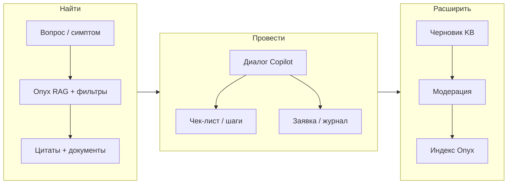

# Copilot — спецификация продукта и архитектуры

**Дата:** 2026-06-03 · актуализация 2026-07-14  
**Контекст:** [masterdocapp](../README.md), [B2B_MVP_SCOPE.md](../../masterdoc/B2B_MVP_SCOPE.md), [TOIR_AI_SYSTEM_DESIGN.md](../../masterdoc/TOIR_AI_SYSTEM_DESIGN.md), [backend/README.md](../../backend/README.md)  
**Статус:** проектирование (до реализации)

> **В реестре AI-агентов ТОиР** ([TOIR_AI_SYSTEM_DESIGN §4.2](../../masterdoc/TOIR_AI_SYSTEM_DESIGN.md)) этот контур называется агент **Copilot** (бывш. «Наставник»): read-only ответы инженеру по документации актива с цитатами. Backend: отдельный **`copilot-service`** (`POST /ai/copilot/*`), без общего ai-gateway. Соседние сервисы: `technologist-service` (загрузка доков и оборудования → карточки автоматически), `intake-service`, `closeout-service` (агент Репортер). Шильдик/QR — только идентификация актива **инженером в поле**, не вход Технолога.

---

## 1. Назначение

**Copilot** — режим приложения Masterdoc для **техника** (и при необходимости диспетчера) сети объектов: быстро найти ответ в документации и базе траблшутинга, пройти сценарий диагностики. Расширение KB с поля — смежный контур (черновики из Репортера / журнала; см. TOIR design).

Отличие от текущего B2C (Atlant):

| | B2C (сейчас) | Copilot (цель) |
|---|--------------|----------------|
| Источник знаний | Публичный FAQ производителя | Документы организации + внутренняя KB |
| Контекст | Модель холодильника (persona) | Объект → оборудование → заявка/журнал |
| Роль пользователя | Владелец техники | Служба эксплуатации |
| Расширение KB | Нет (только Onyx-админ) | Черновик статьи / кейс из чата и журнала |

---

## 2. Персоны и задачи

### Техник на объекте

- Симптом: «не морозит витрина на ТТ-12» → поиск по ИЭ, паспортам, внутренним runbook.
- Нужны **цитаты и ссылки** на фрагмент документа (доверие при аудите).
- После устранения — **зафиксировать решение** в KB (черновик на модерацию).

### Оператор / диспетчер

- Принимает звонок с объекта → **быстрый поиск** без полного чата.
- Смотрит, есть ли **похожий инцидент** в журнале/KB.
- Направляет технику с **готовым чек-листом** из KB.

### Администратор KB (роль позже)

- Публикует/отклоняет черновики, версионирует статьи, привязывает document set в Onyx.

---

## 3. As-is в masterdocapp

```
Root (табы)
├── Chat      → Onyx persona, стриминг, forced internal search
└── Search    → заглушка UI (без API)

EquipmentSelection → выбор Assistant (B2C)
```

**Уже есть и переиспользуем:**

- `ChatStore` + timeline (Thinking / Search / Answer)
- `HttpChatRepository` → `POST /v1/chat/sessions`, стрим сообщений
- Backend: `ONYX_FORCE_INTERNAL_SEARCH`, маппинг persona → assistants
- KMP: Decompose, MVIKotlin, Koin, Compose

**Пробелы для Copilot:**

- Нет scoped search по org/asset/document set
- Нет отдельного UX «поиск без диалога»
- Нет CRUD KB / workflow модерации
- Нет привязки сессии к `siteId` / `assetId` / `workOrderId`

---

## 4. To-be: режим Copilot

### 4.1. Три столпа UX



| Столп | Экран | MVP | Позже |
|-------|-------|-----|-------|
| **Найти** | Поиск | Гибрид: keyword API + опционально RAG snippet | Семантический ранжир, фильтры по типу документа |
| **Провести** | Copilot Chat | Контекст asset + стрим + цитаты | Голос, фото (как B2C detect) |
| **Расширить** | «Сохранить в KB» | Черновик из ответа/журнала | Версии, diff, обязательные поля compliance |

### 4.2. Навигация (рекомендация)

Вариант **A** — flavor `facility` / feature `COPILOT_MODE` (см. B2B scope):

```
Login → Home (объекты / заявки)
  └── Asset detail
        ├── Документы
        ├── Copilot (чат)
        ├── Поиск
        └── Журнал / заявки
```

Вариант **B** — заменить корневые табы B2C на:

```
[ Поиск | Copilot | Заявки ]   + drawer: объект / оборудование
```

**Рекомендация:** вариант A — Copilot живёт **в контексте asset**, не как абстрактный чат Atlant.

---

## 5. Доменная модель (shared)

Новый пакет `shared/.../facility/` (или `copilot/`), не ломая `consumer/`:

```
domain/copilot/
  CopilotScope          # orgId, siteId?, assetId?, workOrderId?
  KnowledgeArticle      # id, title, body, status, tags, assetCategory?
  KnowledgeDraft        # from chat/journal, author, sourceRefs
  SearchHit             # documentId | articleId, snippet, score, citation
  CopilotSession        # chatSessionId + scope

domain/facility/        # из B2B MVP — Site, Asset, WorkOrder, JournalEntry, Document
```

### Связь с Onyx

| Masterdoc сущность | Onyx |
|--------------------|------|
| Organization | Tenant / отдельный **Document Set** на org |
| Asset category | Persona или metadata filter |
| Document (PDF) | File connector → doc в set |
| KnowledgeArticle (опубликована) | Доп. источник: Markdown/file в set «Runbooks» |
| Chat session | Существующий `chat_session` + **metadata** scope |

---

## 6. API (расширение backend)

Целевой backend (ТОиР): чат Copilot идёт в **`copilot-service`** через API Gateway (`POST /ai/copilot/*`), не в общий ai-gateway. Поиск по документам — через тот же контур + `search-service` (Onyx). См. [TOIR_AI_SYSTEM_DESIGN §8.2](../../masterdoc/TOIR_AI_SYSTEM_DESIGN.md).

Текущий B2C `/v1` — только chat + assistants. Для Copilot MVP:

### 6.1. Поиск

```
GET /ai/copilot/search?q=&orgId=&siteId=&assetId=&types=doc,article
```
(алиас/переход с раннего `GET /v1/copilot/search` — допустим на переходный период)

- **Фаза 1:** прокси Onyx internal search через `search-service` / tools Copilot, нормализация в `SearchHit[]` с `citation`, `documentTitle`, `page?`.
- **Фаза 2:** опционально merge с журналами из `ops_db` (dashboard).

### 6.2. Copilot chat → `copilot-service`

```
POST /ai/copilot/sessions
  { personaId, orgId, siteId?, assetId?, workOrderId? }

POST /ai/copilot/sessions/{id}/messages
  { message, stream: true }
  → NDJSON + citations (парсинг Onyx / search packets)
```

`copilot-service` передаёт в Onyx / search-service:

- `forced_tool_id` (как сейчас)
- **document_set_ids** или persona, привязанная к org
- optional **system prompt injection** с inventoryNo, моделью, последними записями журнала (короткий summary)

### 6.3. KB drafts

```
POST   /v1/kb/drafts        { title, body, source: chat|journal, refs[] }
GET    /v1/kb/drafts?status=pending
PATCH  /v1/kb/drafts/{id}   { status: submitted|published|rejected }
```

- **MVP хранение:** Postgres на VPS (рядом с proxy), не в KMP.
- Публикация → файл/запись в Onyx + webhook reindex.

### 6.4. Auth / tenancy

```
Authorization: Bearer <org-scoped JWT>
```

Все copilot/kb endpoints фильтруют по `orgId` из токена. Без мульти-тенанта Copilot в прод не выпускать.

---

## 7. KMP — модули и экраны

### 7.1. Структура (целевая)

```
shared/
  domain/
    consumer/     # Atlant — без изменений поведения
    facility/     # Site, Asset, ...
    copilot/      # Search, KB draft, CopilotSession
  data/
    copilot/      # CopilotApi, SearchRepository, KbDraftRepository
  presentation/
    copilot/
      SearchStore       # реализовать (сейчас заглушка)
      CopilotChatStore  # форк ChatStore + scope + citations UI
      KbDraftStore

composeApp/ui/
  facility/
    AssetDetailScreen.kt
    CopilotChatScreen.kt      # переиспользует ChatMessageBubble, timeline
    CopilotSearchScreen.kt
    KbDraftSheet.kt
```

### 7.2. SearchStore (замена заглушки)

**State:** query, hits[], loading, error, filters (docs / articles / journal)  
**Intent:** QueryChanged, SearchSubmitted, FilterToggled, OpenHit  
**Label:** OpenDocument(hit), OpenCopilotWithQuery(q)

### 7.3. CopilotChatStore

Расширение `ChatStore`:

- `BindScope(CopilotScope)` вместо только `BindAssistant`
- `State.citations: List<Citation>` на последнем assistant message
- Intent `SaveToKbDraft` → POST draft

### 7.4. Переиспользование UI

- `ChatTabContent` / `ChatMessageBubble` / `ChatAssistantTimeline` — общий слой
- `EquipmentSelection` — **не** для facility; выбор asset на `AssetDetail`

---

## 8. Сценарии (user stories)

### US-1: Поиск по симптому

1. Техник на карточке asset вводит «высокая температура камеры».
2. Видит 5 hits: 2 фрагмента PDF, 2 статьи KB, 1 похожая запись журнала (фаза 2).
3. Тап по PDF → просмотр; тап по статье → Copilot с предзаполненным вопросом.

**Критерий:** ответ &lt; 3 с на типовой запрос (при прогретом индексе).

### US-2: Диалог с контекстом

1. Открывает Copilot с привязанным `assetId`.
2. Задаёт уточняющие вопросы; в timeline видит шаг «Поиск в документах».
3. Ответ содержит маркированные цитаты [1][2].

**Критерий:** каждая цитата раскрывается в источник (документ/статья).

### US-3: Расширение KB

1. После успешного ремонта нажимает «Сохранить решение в базу».
2. Редактирует черновик (заголовок, шаги, теги).
3. Отправляет на модерацию; статус «На проверке».

**Критерий:** черновик виден админу в списке; после publish — находится поиском.

### US-4: Из журнала (фаза 1.1)

1. В записи журнала «Устранено: замена датчика» → «Создать статью KB».
2. Prefill из текста записи + asset category.

---

## 9. Нефункциональные требования

| Требование | Решение |
|------------|---------|
| Офлайн | MVP: только черновик заявки; поиск/chat — online |
| Аудит | Логировать `userId`, `sessionId`, `query`, `documentIds` в ответе |
| Безопасность | Org isolation; PAT Onyx только на backend |
| Качество RAG | Обязательные citations; при пустом поиске — явный «не найдено», не галлюцинация |
| CI | `./gradlew check` + существующие integration tests chat |

---

## 10. Фазы реализации

### Фаза 0 — подготовка (1–2 нед)

- [ ] Document set в Onyx на пилотного клиента (PDF + 10–20 runbook Markdown)
- [ ] Persona «Facility Copilot» с forced search по этому set
- [ ] Документ: mapping org → document_set_id в backend env/DB

### Фаза 1 — MVP Copilot (4–6 нед, параллельно B2B сущностям)

- [ ] `GET /v1/copilot/search` + `SearchStore` + `CopilotSearchScreen`
- [ ] `CopilotChatStore` + scope в session create
- [ ] Asset detail entry point (mock asset OK для демо)
- [ ] Citations в UI ответа
- [ ] `POST /v1/kb/drafts` + bottom sheet «Сохранить в KB»

### Фаза 1.1

- [ ] Journal → draft
- [ ] Поиск по закрытым заявкам
- [ ] Фото симптома → detect category (reuse `/assistants/detect`)

### Фаза 2

- [ ] Модерация KB в web admin
- [ ] Версионирование статей
- [ ] Аналитика: top queries без ответа → пробелы в KB

---

## 11. Риски и решения

| Риск | Митигация |
|------|-----------|
| Onyx не отдаёт структурные citations | Парсить `search_tool` packets в `OnyxStreamAccumulator`; fallback — ссылки на document set вручную |
| Смешение B2C и B2B в одном бинарнике | Flavor `consumer` / `facility` или `BuildConfig.COPILOT_ENABLED` |
| Операторы не доверяют AI | Режим «только поиск» без генерации; чат — opt-in |
| Раздувание KB мусором | Обязательная модерация; шаблон статьи (симптом → проверки → решение) |

---

## 12. Открытые вопросы (нужны решения до кода)

1. **Один бинарник или два flavor** для пилота?
2. **Где хранить KB drafts** — только Postgres proxy или сразу Onyx «как документ»?
3. **Нужен ли отдельный persona на объект** или один org-persona + metadata filter?
4. **Язык статей KB** — только RU или multi?
5. **Интеграция с masterdoc-lite** — Copilot только в полном app?

---

## 13. Следующий шаг

После согласования §12:

1. Зафиксировать flavor/навигацию в `B2B_MVP_SCOPE.md` (ссылка на этот документ).
2. Issue breakdown: backend search → KMP SearchStore → Copilot chat scope → KB drafts.
3. Пилот: один document set + один asset tree на демо-организации.
